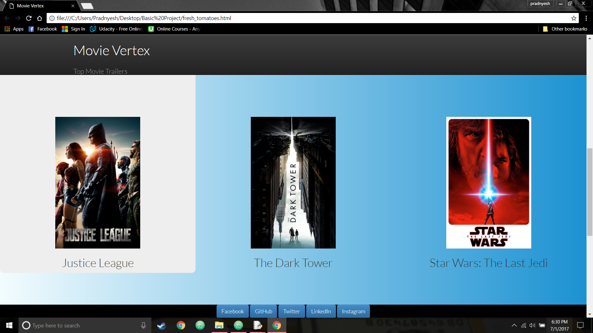

# Project 1 -- The Movie Trailer Website
This project is designed by me while being a part of my [Machine Learning Basic
Nanodegree(MLFND)](https://in.udacity.com/course/machine-learning-engineer-nanodegree--nd009-in-basic/).<br/>
This project was designed and created to improvise as well as strengthen the basic foundations in **Programming in Python**

## Required Libraries
- In order to run this project, the user must have _Python version 2.7 or above_ installed on the Operating System
- IDLE(Python GUI) must be installed on the Machine in order to run the .py files

### Dependencies

The project requires API key from [The Movie DB](https://www.themoviedb.org/), to generate the movie trailer page.
In order to obtain the API, kindly create a account on the link provided below and submit the form application for new API key

```bash
https://www.themoviedb.org/documentation/api?language=en
```

## Guide
* Download the Project from the GitHub url and run the entertainment_center.py by right clicking on it and selecting
```bash
Edit with IDLE
```
After the window for IDLE opens up either press F5 on keyboard, or run the program by doing the following steps
-Run
-Run Module

After the output window appears, wait for few seconds till the time the website is build and loaded.
The website launches automatically


* After API has been generated, input the API instead of the initialized existing key "816d28a515c3309f8986ed251ad27336".
Simply copy paste the API generated in the code line commented with "**Replace here**"


## Sample Website generated by the project
I have also added the sample html page generated.<br/><br />

